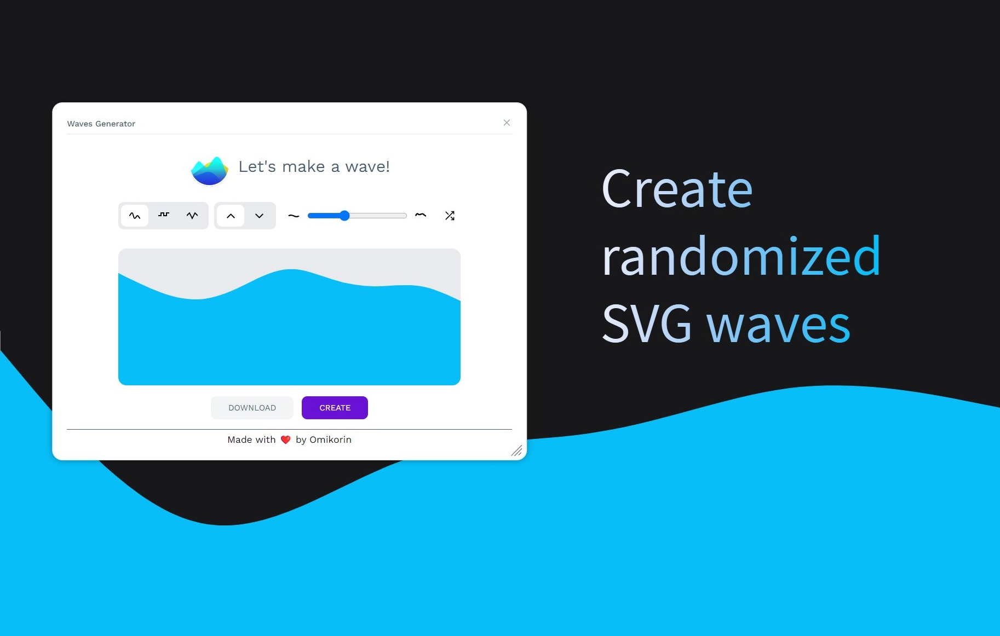

# 🌊 Waves Generator

Create beautiful, customizable wave patterns for your web designs!



## ✨ Why Waves Generator?

- **Multiple Wave Types**: Choose from smooth, stepped, or peaked wave patterns
- **Natural look**: Randomize wave patterns by changing complexity level
- **Live Preview**: Instant visual feedback as you adjust settings
- **Easy Export**: Download your waves as SVG files ready for use in any project

## 🎯 Key Features

### Wave Styles
- Smooth sine waves for flowing animations
- Stepped patterns for geometric designs
- Peaked waves for sharp, dynamic looks

### Rich Customization
- Adjustable wave complexity
- Up/down direction control
- Quick randomize option

## 🚀 Getting Started

1. Visit the [Penpot Plugins Hub](https://penpot.app/penpothub/plugins/waves-generator)
2. Click the "Install" button for Waves Generator
3. Alternative installation: Use this manifest link in Penpot's plugin installer:
   ```
   https://penpot-waves-generator.pages.dev/manifest.json
   ```

## 💻 Development

Want to contribute or run locally? Here's how:

```bash
# Install dependencies
bun install

# Start development server with live preview
bun run dev

# Build for production
bun run build
```

Next, install the plugin using this link:
```
http://localhost:4400/manifest.local.json
```

## 🤝 Contributing

Contributions are welcome! Feel free to submit issues and pull requests.

## 🙏 Acknowledgments
Thanks to Feather Icons for their beautiful open source icons.

## 📄 License

This project is licensed under the [ISC license](./LICENSE).

---

<p align="center">Made with ❤️ by Michał Korczak</p>

---
